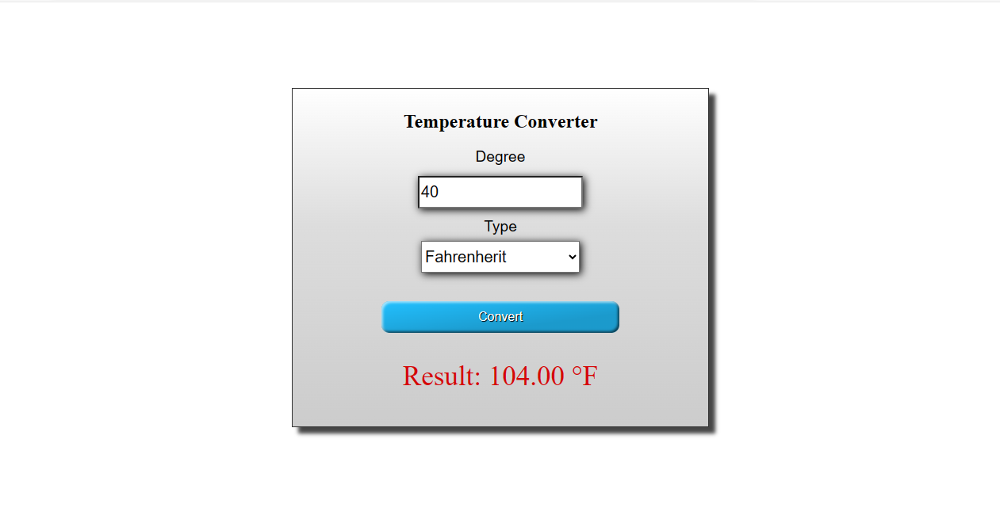

# Temperature Converter

Temperature Converter is a simple web application that allows you to convert temperatures between Fahrenheit, Celsius, and Kelvin.

## Features

- Convert temperatures between Fahrenheit, Celsius, and Kelvin.
- User-friendly interface.
- Real-time temperature conversion.

## Technologies Used

- HTML
- CSS
- JavaScript

## Usage

1. Enter a temperature value in the input field.
2. Select the unit you want to convert from (Fahrenheit, Celsius, or Kelvin) from the dropdown menu.
3. Click the "Convert" button to see the converted temperature.

## How to Run

To run the Temperature Converter on your local machine, follow these steps:

1. Clone this repository to your computer.
2. Open the `temperature.html` file in your web browser.

## Screenshot

## Acknowledgments

- This project was created as part of a coding exercise.
- Inspiration: [Provide any sources or references here if applicable.]

## Author

[Aishwarya_garje]

